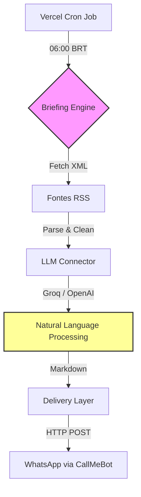

# Daily Briefing: News Automation via Vercel Serverless 🚀


## 🧠 Abstract

**Daily Briefing** é um pipeline de automação jornalística desenhado para combater a sobrecarga de informações (infoxicação). O sistema atua como um editor sênior autônomo: consome dezenas de fontes RSS, filtra o ruído de acordo com preferências pessoais estritas e utiliza modelos de linguagem (Groq/OpenAI) para redigir um briefing diário direto ao ponto, entregando-o de forma passiva via WhatsApp.

## ⚙️ Core Architecture (Serverless Push)

O sistema foi arquitetado para máxima eficiência e custo zero, rodando 100% na borda via *Vercel Cron Jobs* sem necessidade de infraestrutura local permanente.



## 🚀 Key Features

*   **Automação Zero-Click**: Agendamento nativo via Vercel Cron. Sem botões, sem servidores locais ligados. O dado vai até você.
*   **Filtro de Preferências Pessoais**: Injeção direta de prompts no system layer para que a IA descarte assuntos irrelevantes diretamente na origem.
*   **Deep Translation Rigorosa**: Controle estrito via prompt engineering para garantir que 100% dos despachos gringos sejam traduzidos para Português do Brasil limpo e sem jargões tortos.
*   **Entrega Passiva via WhatsApp**: Fim da navegação compulsiva. O resumo executivo diário consolidado.

## 🛠️ Repository Structure

```bash
News/
├── api/               # Vercel Serverless Endpoints
│   └── cron.js        # Gatilho de execução diária (Entrypoint)
├── lib/               # Lógica de Negócios Central
│   ├── ai.js          # Prompts estritos e handlers LLM (Groq/OpenAI)
│   ├── briefing.js    # Orquestrador do pipeline de dados
│   ├── delivery.js    # Disparo de mensagens (CallMeBot)
│   └── rss.js         # Extrator e parseador de XML
├── sources.json       # Lista de jornais e diretrizes do usuário
└── vercel.json        # Configuração do Cron Job (0 9 * * *)
```

## 💻 Quick Start (Deploy no Vercel)

1. Faça um Fork ou Clone deste repositório em sua conta.
2. Crie um projeto no Vercel conectando seu repositório do GitHub.
3. Adicione as seguintes *Environment Variables*:
   *   `GROQ_API_KEY`: Chave da API do Groq
   *   `WHATSAPP_PHONE`: Seu celular (com DDI, ex: 5511999999999)
   *   `WHATSAPP_API_KEY`: Sua chave obtida via CallMeBot
4. Realize o Deploy. O sistema enviará a primeira notificação amanhã pontualmente às 06:00 BRT.

## 📄 License

Distribuído sob a Licença MIT.
